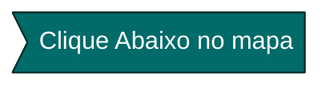

#

  ```mermaid

%%{init: {'theme': 'base', 'themeVariables': { 'primaryColor': '#285570', 'edgeLabelBackground':'#777777', 'tertiaryColor': '#285570', 'primaryTextColor': 'white', 'lineColor': 'coral'}}}%%

flowchart LR;

 A:::someclass
    classDef someclass fill:#7e499e;
    
1(AVANADE) --> 1A(AVANADE WEBSITE) 
1(Season_01) --> 1B(DIGITAL INNOVATTION ONE) 
A((DECOLA  TECH AVANADE 2022\n Branch Master\n )) --> 1((REACT NATIVE))


 linkStyle 1 stroke-width:2px,fill:none,stroke:coral;
  linkStyle 2 stroke-width:2px,fill:none,stroke:coral;
  linkStyle 2 stroke-width:2px,fill:none,stroke:coral;
    linkStyle 1 stroke-width:2px,fill:none,stroke:coral;


click A "https://github.com/TeoNogueira/Decola-Tech-BootCamp"
click 1 "www."
click 1A "https://www.avanade.com/pt-br"
click 1B "https://www.dio.me/"

```
#


# 9 - Javascript Assíncrono

 Nesta atividade destaco a importância de exercitarmos algumas funcionalidades do assincronismo com o javascript, fizemos uma API onde colocamos imagens de gatos gerada através de um botão. Aprendemos sobre: **promises**, **async/await**, **fetch**, **API** e também tivemos boas práticas de **html e css**.
 
 
 
